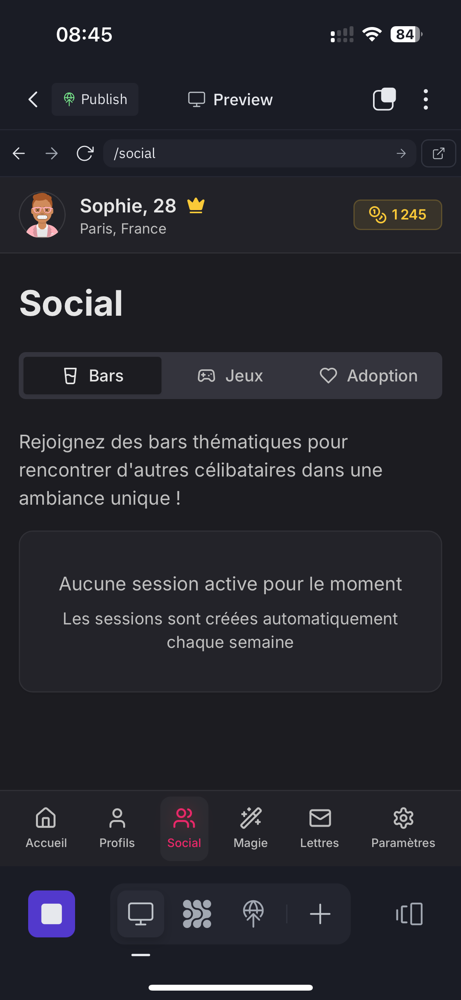
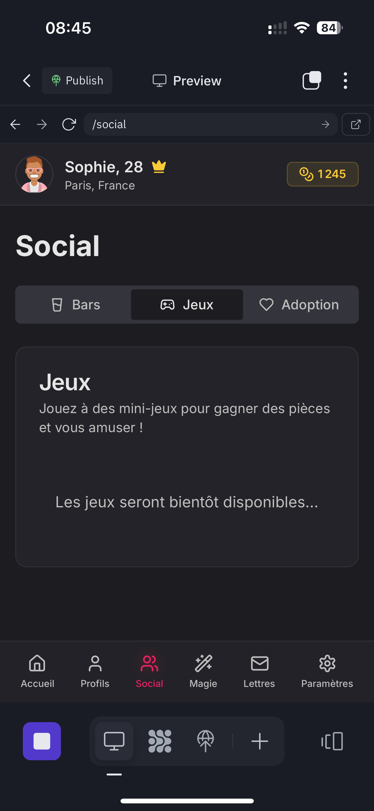
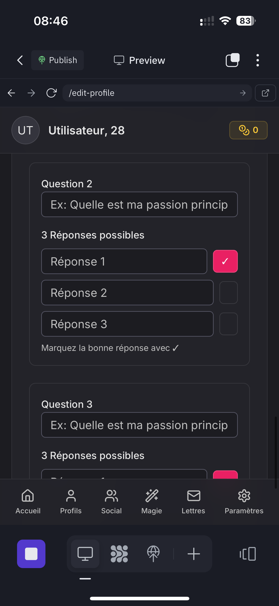
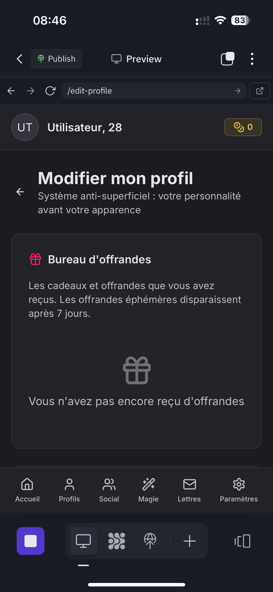
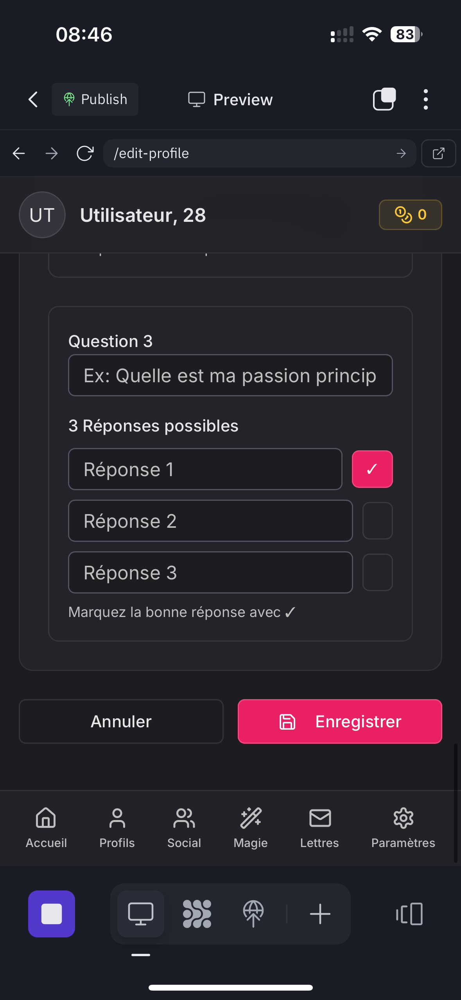

# ❤️ JeuTaime — Application Flutter

**JeuTaime** est une application de **rencontres ludiques et bienveillantes**, centrée sur le jeu, la curiosité et la sincérité.  
Plutôt qu'un "match" instantané, chaque lien se construit à travers **lettres, défis, bars virtuels** et **offrandes symboliques**.

---

## 🎯 Objectif
Créer des connexions réelles à travers des interactions humaines et des mini-jeux.  
Chaque action (défi réussi, offrande, sourire…) permet de renforcer les liens et de gagner des points.

---

## 📸 Captures d'écran

### 📱 Interface mobile

#### 🏠 Écrans d'accueil
| Fonctionnalité | Capture |
|---|---|
| Écran principal |  |
| Écran de bienvenue |  |
| Découverte de profils |  |

#### 🔐 Authentification
| Fonctionnalité | Capture |
|---|---|
| Écran de connexion |  |
| Écran d'inscription |  |

#### 👤 Profil utilisateur
| Fonctionnalité | Capture |
|---|---|
| Vue du profil |  |
| Édition du profil |  |
| Paramètres |  |

### 💌 Système de lettres
| Fonctionnalité | Capture |
|---|---|
| Liste des conversations |  |
| Écriture d'une lettre |  |
| Lecture d'une lettre |  |
| Boîte à souvenirs |  |

### 🍸 Bars virtuels
| Fonctionnalité | Capture |
|---|---|
| Liste des bars |  |
| Interface principale |  |
| Mini-jeux |  |
| Bar privé |  |

### 💎 Système d'économie
| Fonctionnalité | Capture |
|---|---|
| Affichage des points |  |
| Boutique d'offrandes |  |
| Historique transactions |  |
| Système de récompenses |  |

---

## 🧩 Fonctionnalités principales

### 💌 Lettres et interactions
- Lettres limitées à **500 mots**  
- Une lettre à la fois → favorise les réponses sincères  
- Possibilité d'archiver les lettres dans la **Boîte à Souvenirs**  
- Relance automatique en cas de silence (anti-ghosting)

### 🍸 Bars
- Groupes éphémères : **2 hommes / 2 femmes** maximum  
- Mini-jeux et défis thématiques chaque semaine  
- Remplacement automatique des membres inactifs  
- Bars privés : le créateur choisit les thèmes, musiques et défis  

### 💎 Points, Offrandes et Magie
- +50 points chaque jour de connexion  
- Points gagnés via défis, jeux ou interactions spéciales  
- Offrir une rose, un café ou un sort symbolique (magie douce)  
- Les animations spéciales (bars privés, offrandes rares) coûtent des points  

### 🧸 Adoption (nouveauté)
- Un membre expérimenté peut **"adopter"** un nouvel arrivant  
- L'adopté bénéficie d'un guide et de bonus de démarrage  
- L'adoptant gagne des points et un badge "Protecteur"

### 🏆 Défis et mini-jeux
- Petits jeux ou missions collectives dans les bars  
- Exemples : quiz romantiques, défis photo, "compliment miroir"  
- Système de score individuel et de groupe

---

## 🛠️ Technologies utilisées

- **Flutter** - Framework mobile cross-platform
- **Firebase** - Backend et authentification
- **Dart** - Langage de programmation
- **VS Code** - Environnement de développement

---

## 🚀 Installation et développement

### Prérequis
- Flutter SDK
- Dart SDK
- Android Studio / Xcode (pour l'émulation)
- Firebase CLI

### Commandes utiles
```bash
# Installer les dépendances
flutter pub get

# Lancer en mode debug
flutter run

# Build pour production
flutter build apk
```

---

## 📁 Organisation des captures d'écran

> 📸 **Toutes les captures d'écran** sont organisées dans `/assets/screenshots/` par plateforme et fonctionnalité.
> 
> 🔧 **Outils disponibles** :
> - `scripts/take_screenshots.sh` - Prise automatique de captures
> - `scripts/auto_organize_screenshots.sh` - Organisation automatique
> - `scripts/create_preview.sh` - Aperçu HTML interactif

---

## 🤝 Contribution

Les contributions sont les bienvenues ! Consultez nos guides de développement dans `/docs/` pour plus d'informations.

---

## 📄 Licence

Ce projet est sous licence MIT. Voir le fichier `LICENSE` pour plus de détails.